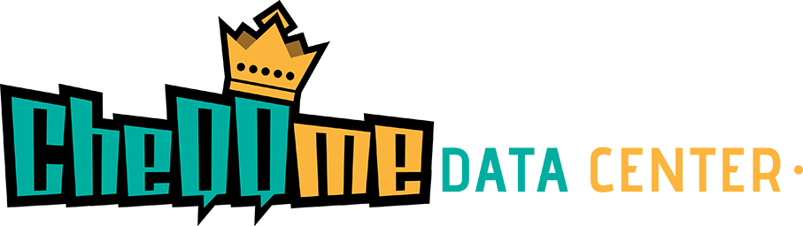

## Overview

**CheQQme Data Center** is an internal knowledge & operations hub built with Laravel + Filament. It centralizes:

-   Important / frequently used URLs (SharePoint, tools, internal dashboards)
-   Client & project records
-   Internal documents & reference files
-   Action Tasks (Kanban style board)

It improves discoverability, reduces context switching, and lays groundwork for future AI-assisted search.

## Core Objectives

-   Centralize scattered project & resource information
-   Provide fast navigation and lightweight task tracking (Action Board)
-   Serve as a structured dataset for upcoming AI / semantic search features
-   Personal full‑stack learning sandbox (Laravel, Filament, modern tooling)

---

## Tech Stack

| Area         | Tools / Frameworks                             |
| ------------ | ---------------------------------------------- |
| Language     | PHP 8.x                                        |
| Backend      | Laravel 12.x                                   |
| Admin / UI   | FilamentPHP v3, Tailwind CSS                   |
| Realtime UX  | Livewire (Filament integrated)                 |
| Database     | SQLite (dev) → MySQL/PostgreSQL (future)       |
| Build Tools  | Vite, NPM                                      |
| Testing      | PHPUnit, Laravel test utilities                |
| Activity Log | spatie/laravel-activitylog (planned wiring)    |
| Kanban Board | Relaticle Flowforge (custom Action Board page) |

---

## Major Features (Current)

-   URL / Link management with metadata & creator tracking
-   Project & Client entities (foundation for relationships)
-   Document records (file storage ready for local → S3 migration)
-   Action Board (Kanban) for internal tasks (columns: To Do / In Progress / To Review / Completed / Archived)
-   Basic user authentication (Filament panel guarded)
-   Consistent environment template (`.env.example`) for quick onboarding

## In Progress / Planned

-   Tagging system (polymorphic tags across Projects / Documents / Links)
-   Advanced authorization (policies & role-based access control)
-   Activity & audit logging (create/update/delete trails)
-   Full‑text / Scout based search + AI powered semantic layer
-   Bulk import/export (CSV / XLSX)
-   Background job queue (async file processing & notifications)
-   S3 storage + signed download links

---

## Environment Setup

Follow these steps after cloning the repository.

### 1. Requirements

-   PHP 8.x with required Laravel extensions (bcmath, ctype, fileinfo, json, mbstring, openssl, pdo, tokenizer, xml)
-   Composer
-   Node.js (LTS) + npm
-   Git

### 2. Clone & Install Dependencies

```bash
git clone <repo-url> cheqqme-data-center
cd cheqqme-data-center
composer install
npm install
```

### 3. Environment File

```bash
cp .env.example .env
php artisan key:generate
```

Optional: switch from SQLite to MySQL later by uncommenting the MySQL block inside `.env` and filling credentials.

### 4. Database & Storage

```bash
php artisan migrate --seed   # if seeders available
php artisan storage:link     # expose storage/app/public → public/storage
```

SQLite note: The default `DB_DATABASE=database/database.sqlite` file is committed (or will be created). If it does not exist:

```bash
touch database/database.sqlite
```

### 5. Build Frontend Assets (Dev)

Run in two terminals (or use a process manager):

```bash
php artisan serve
npm run dev
```

Then visit: http://127.0.0.1:8000 (Filament panel typically at /admin unless customized).

### 6. Running Tests

```bash
php artisan test
```

Later you can add a CI workflow (GitHub Actions) to automate this.

### 7. Optional: Queue Worker (Future)

Once QUEUE_CONNECTION is not `sync`:

```bash
php artisan queue:work
```

### 8. Common Environment Variables (Reference)

| Category    | Key Highlights                                                  |
| ----------- | --------------------------------------------------------------- |
| App         | APP_ENV, APP_DEBUG, APP_URL, APP_TIMEZONE                       |
| Database    | DB_CONNECTION, DB_DATABASE (or MYSQL vars)                      |
| Cache/Queue | CACHE_DRIVER, QUEUE_CONNECTION, SESSION_DRIVER                  |
| Filesystem  | FILESYSTEM*DRIVER (public / s3) + AWS*\* (future)               |
| Mail        | MAIL_MAILER, MAIL_HOST, MAIL_PORT, MAIL_USERNAME, MAIL_PASSWORD |
| Frontend    | VITE_APP_NAME                                                   |
| Security    | SANCTUM_STATEFUL_DOMAINS, APP_TRUSTED_PROXIES (future)          |

---

## Project Structure (Highlights)

```
app/
	Filament/          # Resources, Pages (incl. ActionBoard), Widgets
	Models/            # Core Eloquent models (Task, Project, Document, etc.)
resources/
	views/             # Blade templates
database/
	migrations/        # Schema definitions
	seeders/           # (Add seeders for demo data)
routes/
	web.php            # Web routes (Filament auto-registers its own)
public/              # Public assets (built via Vite)
```

---

## 🗂 Action Board (Kanban)

Implemented via a custom Filament Page extending a Kanban board component. Columns reflect task lifecycle. Each card shows due date color indicators and assignment status. Future upgrades: inline comment thread, drag ordering persistence optimization, filters & swimlanes.

---

## Testing Strategy (Planned)

-   Feature tests: CRUD for Projects, Documents, Important URLs
-   Livewire component tests: Task comments & board interactions
-   Policy tests once authorization is introduced

Add seeds + factories to simplify realistic scenario coverage.

---

## Deployment (Basic Outline)

1. Provision server (Linux) with PHP 8.x + Nginx + database
2. Clone repo & run `composer install --no-dev`
3. Copy `.env.example` → `.env`, configure production values
4. Run: `php artisan key:generate` (one time)
5. Run migrations: `php artisan migrate --force`
6. Build assets: `npm ci && npm run build`
7. Set correct permissions for `storage` & `bootstrap/cache`
8. Configure queue worker & scheduler (cron: `* * * * * php /path/artisan schedule:run >> /dev/null 2>&1`)
9. Use a process manager (Supervisor) for `php artisan queue:work`

---

## Authentication & Security

-   Currently relies on Laravel auth scaffolding + Filament guard
-   Next steps: add Policies (Project, Document, URL) & roles field on `users` table
-   Consider rate limiting if public endpoints added later

---

## Roadmap (Detailed)

Legend: ✅ Done · 🛠 In Progress · 🔜 Planned

| Feature                 | Status | Notes                             |
| ----------------------- | ------ | --------------------------------- |
| CRUD for Important URLs | ✅     | Core implemented                  |
| Projects & Clients      | ✅     | Base models & forms               |
| Documents storage       | ✅     | Local disk; S3 planned            |
| Action Board (Tasks)    | ✅     | Kanban columns + attribute badges |
| Basic Auth (Filament)   | ✅     | Panel restricted                  |
| Environment template    | ✅     | `.env.example` structured         |
| Tagging system          | 🔜     | Polymorphic (tags)                |
| Activity / Audit Log    | 🔜     | Wire spatie/activitylog           |
| Role-based Policies     | 🔜     | Granular access control           |
| Full‑text / AI Search   | 🔜     | Scout + embeddings layer          |
| Bulk Import / Export    | 🔜     | CSV/XLSX via Laravel Excel        |
| Background Queue        | 🔜     | For heavy file ops                |
| S3 Integration          | 🔜     | Move FILESYSTEM_DRIVER to s3      |

---

## 🤝 Contributions

Currently a solo project; outside contributions may open later. Feel free to fork for learning (respect proprietary data & branding).

---

## References

-   [Laravel Docs](https://laravel.com/docs/12.x)
-   [Filament Docs](https://filamentphp.com/docs)

---

## Author

Crafted by **Amirul** (Creative Designer & Aspiring Developer) with assistance from an AI coding companion.

---

## Notice

This repository is public for demonstration & portfolio purposes. Not licensed for commercial redistribution. Remove or anonymize any sensitive data before sharing.
