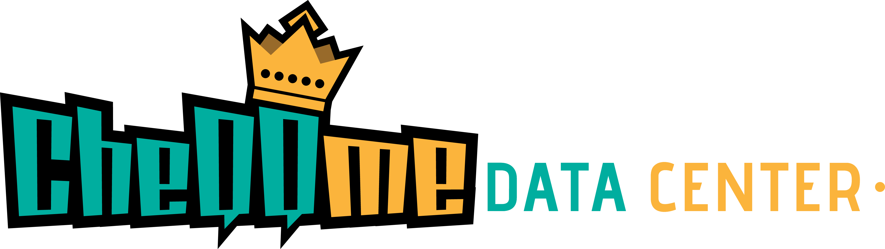

# CheQQme Data Center

**Internal Knowledge & Operations Hub**

[](https://php.net)
[](https://laravel.com)
[](https://filamentphp.com)
[](https://livewire.laravel.com)

---

## Table of Contents

### Getting Started

-   [Overview](#overview)
-   [Core Objectives](#core-objectives)
-   [Tech Stack](#tech-stack)
-   [Feature Roadmap](#feature-roadmap)
-   [Quick Start Guide](#quick-start-guide)

### Core Features

-   [Major Features](#major-features-current)
-   [Weather System](#weather-system)
-   [Configuration & Environment Variables](#configuration--environment-variables)

### Integrations & Services

-   [Spotify Integration](#spotify-integration)
-   [Online Status System](#online-status-system)
-   [Meeting Links & Video Conferencing](#meeting-links--video-conferencing)
-   [Event Calendar System](#event-calendar-system)
-   [Custom User Profile Menu](#custom-user-profile-menu)
-   [What's New (Changelog)](#whats-new-changelog-system)

### Advanced Features

-   [Advanced Comments System](#advanced-comments-system)
-   [MCP Server Setup](#mcp-server-first-time-setup)

### Development & Deployment

-   [Project Structure](#project-structure-highlights)
-   [API Routes](#selected-routes)
-   [Local Development](#local-development)
-   [Testing](#testing)
-   [Deployment](#deployment-production)
-   [Authentication & Security](#authentication--security)

### Resources

-   [References](#references)
-   [Author](#author)

---

## Overview

**CheQQme Data Center** is an internal knowledge & operations hub built with Laravel + Filament, now featuring MCP server integration for AI/semantic search. It centralizes:

-   Important / frequently used URLs (SharePoint, tools, internal dashboards)
-   Client & project records
-   Internal documents & reference files
-   Action Tasks (Kanban style board)

It improves discoverability, reduces context switching, and lays groundwork for future AI-assisted search and MCP-powered automation.

## Core Objectives

-   Centralize scattered project & resource information
-   Provide fast navigation and lightweight task tracking (Action Board)
-   Serve as a structured dataset for upcoming AI / semantic search features
-   Personal full‑stack learning sandbox (Laravel, Filament, modern tooling)

---

## Tech Stack

| Area             | Tools / Frameworks                                                   |
| ---------------- | -------------------------------------------------------------------- |
| Language         | PHP 8.2.29                                                           |
| Backend          | Laravel 12.31.1                                                      |
| Admin / UI       | Filament v3.3.41, Tailwind CSS v3.4.17                               |
| Realtime UX      | Livewire v3.6.4, Laravel Reverb v1.6.0, Laravel Echo v2.2.4          |
| Authentication   | Laravel Sanctum v4.2.0, Laravel Socialite v5.23.0                    |
| Database         | SQLite (dev) → MySQL/PostgreSQL (future)                             |
| MCP Servers      | Node.js, SQLite, bcrypt 6.0.0, dotenv 17.2.1, Playwright MCP v0.0.37 |
| Build Tools      | Vite v7.1.3, Laravel Vite Plugin v2.0.0, NPM                         |
| Testing          | PHPUnit 11.5.41, Laravel testing utilities, Livewire component tests |
| Activity Log     | Spatie Activitylog + Filament Activitylog plugin                     |
| Kanban Board     | Relaticle Flowforge v0.2.1 (custom Action Board page)                |
| Image Processing | Intervention Image v3.11                                             |
| External APIs    | Google Calendar API, Zoom API, Spotify Web API, OpenWeatherMap API   |
| Code Quality     | Laravel Pint v1.25.1                                                 |

---

## Major Features (Current)

-   **AI-Powered Chatbot** with OpenAI integration
    -   Floating chat button accessible from anywhere in the app
    -   Context-aware responses about platform features and navigation
    -   Conversation memory and intelligent assistance with history page
    -   Custom CheQQme persona for platform-specific help
    -   Backup and restore functionality for conversation history
-   **Spotify Integration** with Web Playback SDK
    -   Real-time "Now Playing" widget in user dropdown and modal
    -   Spotify Web Playback SDK with optimized instant loading
    -   Seamless API fallback for cross-device playback tracking
    -   OAuth2 authentication with automatic token refresh
    -   Album art display with progress bar and playback controls
    -   Connect/disconnect from Profile page
-   **Online Status System** with real-time presence
    -   Real-time status indicators (Online, Away, Do Not Disturb, Invisible)
    -   Interactive status change dropdown for current user
    -   Laravel Reverb Presence Channels for WebSocket communication
    -   Status synchronization across all users and sessions
    -   Visual indicators in avatars, user lists, and comment threads
    -   Customizable sizes and tooltip support
-   **Meeting Links Management** with platform integrations
    -   **Google Meet Integration**:
        -   OAuth2 authentication with Google Calendar
        -   Automatic meeting link generation via Calendar API
        -   Event creation with conferencing details
        -   Connection management from Profile page
    -   **Zoom Integration**:
        -   OAuth2 authentication with Zoom
        -   Scheduled meeting creation with passcode support
        -   Waiting room and host controls configuration
        -   Connection management from Profile page
    -   Resource associations (clients, projects, documents, URLs)
    -   User invitations and meeting notes
    -   Copy-to-clipboard functionality
-   **Calendar System** with comprehensive event management
    -   Custom calendar modal with month/year navigation
    -   Multi-type event display (Tasks, Meetings, Holidays, Birthdays)
    -   Type filtering with visual indicators
    -   Public holidays integration with regional support
    -   Color-coded events (priority-based for tasks, blue for meetings)
    -   Quick navigation to event detail pages
    -   Performance-optimized queries with date-range scoping
-   **Weather System** with intelligent location management
    -   Real-time weather data and 7-day forecasts via greeting modal
    -   Smart location detection: prioritizes user settings over auto-detection
    -   Manual location configuration in Settings page
    -   Automatic geolocation fallback when no location is set
    -   Location-based timezone support for sunrise/sunset times
    -   OpenWeatherMap API integration with 3-hour caching
-   **MCP Server Integration** (Node/Express) reading the same SQLite DB as Laravel
    -   Auth via `x-api-key` header; endpoints for users, tasks, comments, clients, projects, documents, important-urls, phone-numbers
    -   Password hash compatible: bcrypt `$2b$` is converted to `$2y$` for Laravel
-   **Action Board (Kanban)** using Relaticle Flowforge
    -   Columns: To Do / In Progress / To Review / Completed / Archived
    -   Due date color badges (red/yellow/gray/green), single assignee badge with self-highlighting
    -   Attachments with thumbnail preview and image optimization
    -   Inline resource selectors for client, projects, documents, important URLs
    -   Advanced filtering: search, assigned user, due date presets, priority levels
    -   Real-time comment count badges on cards
    -   Performance optimization: 300-task limit on initial load (Trello approach)
    -   Dynamic navigation badge showing active tasks count
-   **Advanced Comments System** with comprehensive features
    -   **Comment Structure & Display**:
        -   Two-tier hierarchy: Parent comments and nested replies
        -   Visual connecting lines showing reply relationships
        -   Comment timestamps with "time ago" format (e.g., "2 hours ago")
        -   User avatars with online status indicators
        -   Comment author display with full name and username
        -   Automatic "edited" indicator when comments are modified
        -   Soft delete with "deleted" placeholder preservation
    -   **Rich Text Editor** (Trix):
        -   Professional-grade WYSIWYG editor with formatting toolbar
        -   Strict HTML sanitization (only semantic tags: bold, italic, underline, links, lists)
        -   XSS protection with allowlist-based HTML filtering
        -   Keyboard shortcuts: Ctrl+Enter to submit
        -   Leading/trailing whitespace automatically stripped
        -   Minimum 3-character validation for meaningful comments
    -   **@Mentions System**:
        -   **Smart Detection**: Longest-prefix matching algorithm for accurate user identification
        -   **Real-time Dropdown**: Type `@` to trigger user search dropdown
            -   Search by username, full name, or email
            -   Keyboard navigation (Arrow keys, Enter, Escape)
            -   Mouse click selection support
            -   Auto-close when clicking outside
        -   **@Everyone Support**: Mention all users with special `@Everyone` tag
        -   **Visual Rendering**: Mentions displayed as inline blue badges at view-time
        -   **Smart Extraction**: Supports both single-word usernames and multi-word full names
        -   **Notifications**: Automatic Filament database notifications with:
            -   Deep-link to specific task and comment
            -   Commenter information and comment preview
            -   Real-time notification badge updates
            -   5-second polling fallback for reliability
    -   **Threaded Replies**:
        -   **Nested Structure**: Visual hierarchy with indentation
        -   **Reply Actions**: Each reply has its own action menu
            -   Edit reply inline
            -   Delete reply (soft delete)
            -   Focus on single reply
            -   React to replies with emojis
        -   **Visual Indicators**:
            -   Connecting lines from parent to replies
            -   Slightly smaller avatars for replies (differentiation)
            -   Reply count badge on parent comments
            -   "Replying to @username" context indicator
        -   **Collapse/Expand**: Toggle reply visibility for long threads
        -   **Reply Composer**: Dedicated reply form under parent comment
    -   **Emoji Reaction System**:
        -   **Comprehensive Picker**:
            -   Simplified emoji library with categories (Smileys, People, Nature, Food, etc.)
            -   Searchable with keyword matching (e.g., "happy" shows 😊 😃 😄)
            -   Recent emojis section for quick access (last 10 used)
            -   Visual emoji grid with hover previews
            -   One-click to add reaction
        -   **Reaction Display**:
            -   Inline reaction pills below each comment
            -   Shows emoji + count (e.g., "👍 5")
            -   Highlighted if current user reacted
            -   Click to toggle your reaction on/off
        -   **User Attribution**:
            -   Hover over reaction pill to see user list
            -   Tooltip shows "You, John, and 3 others" format
            -   Timestamps for each reaction
            -   Real-time updates via Livewire
        -   **Multiple Reactions**: Users can add multiple different emojis to same comment
        -   **Performance**: Efficient database queries with eager loading
    -   **Focus Mode**:
        -   **Single Comment View**: Click comment to enter distraction-free mode
        -   **Full-Height Display**: Comment expands to fill available space
        -   **Sticky Controls**: Exit button remains visible while scrolling
        -   **Auto-Hide Elements**:
            -   Comment composer temporarily hidden
            -   Visual connecting lines removed
            -   Other comments fade out
            -   Only focused comment and its replies visible
        -   **Smart Integration**:
            -   Dropdowns auto-close when entering focus mode
            -   Escape key to exit focus mode
            -   Click outside to exit (optional)
        -   **Nested Focus**: Can focus on parent comment or individual replies
    -   **Content Management**:
        -   **Inline Editing**:
            -   Click "Edit" to replace comment with editor
            -   Pre-filled with existing content
            -   Save or Cancel options
            -   Automatic "edited" timestamp indicator
            -   Preserves @mentions and formatting
        -   **Soft Delete**:
            -   Comments marked as deleted, not removed from database
            -   Shows "[deleted]" placeholder
            -   Preserves thread structure and reply relationships
            -   Admin restoration capability
            -   Activity log entry for audit trail
        -   **Validation & Sanitization**:
            -   XSS prevention with HTML Purifier
            -   Minimum character requirements
            -   Maximum length limits (configurable)
            -   URL validation for links
            -   Automatic whitespace normalization
        -   **Activity Logging**:
            -   All comment operations logged (create, edit, delete, restore)
            -   User attribution and timestamps
            -   Viewable in Filament Activity Log resource
            -   IP address and user agent tracking
    -   **Performance Optimizations**:
        -   Eager loading of relationships (user, task, reactions)
        -   Query result caching for frequently accessed comments
        -   Lazy loading of emoji picker (loaded on first open)
        -   Debounced search in mention dropdown (300ms)
        -   Pagination for long comment threads
        -   Optimized database indexes on foreign keys
-   **Image Optimization Service** for efficient file handling
    -   Automatic thumbnail generation for Kanban card previews
    -   Medium-sized image generation for detail views
    -   On-demand optimization with caching
    -   Intervention Image v3 with GD driver
    -   Cleanup utilities for orphaned thumbnails
-   **Activity & Audit Logging** across all major entities
    -   Spatie Activitylog tracking changes on all core models
    -   Task move events with old/new status and order tracking
    -   Filament Activitylog plugin with timeline views
    -   Per-resource activity log relation managers
-   **Comprehensive Entity Management** with Filament Resources
    -   **Users**: Full CRUD with roles, status management, external service connections
    -   **Clients**: Company information, contacts, associated projects
    -   **Projects**: Client relationships, status tracking, documents, URLs
    -   **Documents**: File uploads, type categorization, project associations
    -   **Important URLs**: Bookmarks with client/project relationships
    -   **Phone Numbers**: Contact directory with notes
    -   **Tasks**: Priority-based, assignable, with rich attachments
    -   **Meeting Links**: Platform integration (Google Meet, Zoom)
    -   **Trello Boards**: External board integration and management
-   **Enhanced User Profile Page**
    -   Personal information management
    -   Timezone and location settings
    -   External service connections (Spotify, Google Calendar, Zoom)
    -   Connection status indicators and management
-   **User authentication** (Filament panel) with real-time notifications
    -   Database notifications with 5-second polling
    -   @mention notifications with deep-links to tasks
    -   User status presence system
-   **Internationalization (i18n)** with multi-language support
    -   English and Malay (Bahasa Malaysia) translations
    -   Language switcher in navigation
    -   Comprehensive translation coverage for all features
-   **What's New (Changelog)** system with Git integration
    -   Automatic Git commit history parsing
    -   Paginated commit display (10 per page)
    -   Commit details with author, date, message, and description
    -   Gravatar integration for author avatars
    -   Git tag display for version releases
    -   Expandable commit descriptions
    -   Dark mode support with beautiful UI
    -   Accessible via What's New banner button in Login page or User Profile menu modal
-   **Custom User Profile Menu** with rich user information display
    -   User-uploaded avatar with 4-size border overlay
    -   Customizable cover image (or default if not set)
    -   User ID badge display
    -   Interactive online status indicator with dropdown
    -   Username, full name, email display
    -   Phone number and date of birth (optional fields)
    -   Dynamic service connection badges (Google, Zoom, Spotify, etc.)
    -   Country and timezone badges
    -   Integrated Spotify "Now Playing" widget (when connected)
    -   Custom menu items (Profile, Settings, Chatbot History, Event Calendar, What's New (Changelog), Logout)
    -   Theme switcher for dark/light mode
    -   Responsive design with optimized dropdown positioning
-   Consistent environment template (`.env.example`) for quick onboarding

---

## Feature Roadmap

### Completed Features ✅

-   **AI-Powered Chatbot**: OpenAI integration with conversation history & backups
-   **Spotify Integration**: Web Playback SDK + OAuth2 with real-time updates
-   **Online Status System**: Real-time presence with Laravel Reverb
-   **Meeting Links**: Multi-platform support (Google Meet, Zoom)
-   **Calendar System**: Multi-type events with filtering & public holidays
-   **Weather System**: OpenWeatherMap with smart location detection
-   **Advanced Comments**: @mentions, reactions, threading, focus mode
-   **Custom Profile Menu**: Rich user info with badges and integrations
-   **What's New**: Git-based automatic changelog with pagination
-   **Image Optimization**: Automatic thumbnails with Intervention Image
-   **Comprehensive CRUD**: 9 Filament resources (Users, Clients, Projects, Documents, etc.)
-   **Activity Logging**: Spatie + Filament plugin with timeline views
-   **Internationalization**: English & Malay translations
-   **MCP Servers**: Node.js API + Playwright browser automation
-   **Dashboard Widgets**: Stats, recent items, board viewers

### In Development 🛠

-   Tagging system (polymorphic tags across Projects / Documents / Links)
-   Advanced authorization (policies & role-based access control)

### Planned 🔜

-   Full‑text / Scout based search + AI powered semantic layer
-   Bulk import/export (CSV / XLSX)
-   Background job queue (async file processing & notifications)
-   S3 storage + signed download links
-   Microsoft Teams integration
-   Email notifications with rich templates
-   Public API v2 with rate limiting

---

## Quick Start Guide

### **Prerequisites (If Programming Tools Not Installed)**

**For Windows:**

1. Install **Chocolatey** (Package Manager):

    ```bash
    # Run in PowerShell as Administrator
    Set-ExecutionPolicy Bypass -Scope Process -Force; [System.Net.ServicePointManager]::SecurityProtocol = [System.Net.ServicePointManager]::SecurityProtocol -bor 3072; iex ((New-Object System.Net.WebClient).DownloadString('https://community.chocolatey.org/install.ps1'))
    ```

2. Install **PHP 8.2+**:

    ```bash
    choco install php
    choco install composer
    ```

3. Install **Node.js**:

    ```bash
    choco install nodejs
    ```

4. Install **Git**:
    ```bash
    choco install git
    ```

**For macOS:**

1. Install **Homebrew** (Package Manager):

    ```bash
    /bin/bash -c "$(curl -fsSL https://raw.githubusercontent.com/Homebrew/install/HEAD/install.sh)"
    ```

2. Install **PHP 8.2+**:

    ```bash
    brew install php@8.2
    brew install composer
    ```

3. Install **Node.js**:

    ```bash
    brew install node
    ```

4. Install **Git**:
    ```bash
    brew install git
    ```

**For Ubuntu/Debian Linux:**

1. Update system:

    ```bash
    sudo apt update && sudo apt upgrade -y
    ```

2. Install **PHP 8.2+**:

    ```bash
    sudo apt install software-properties-common
    sudo add-apt-repository ppa:ondrej/php
    sudo apt update
    sudo apt install php8.2 php8.2-cli php8.2-common php8.2-mbstring php8.2-xml php8.2-zip php8.2-sqlite3 php8.2-curl php8.2-gd php8.2-bcmath
    ```

3. Install **Composer**:

    ```bash
    curl -sS https://getcomposer.org/installer | php
    sudo mv composer.phar /usr/local/bin/composer
    ```

4. Install **Node.js**:

    ```bash
    curl -fsSL https://deb.nodesource.com/setup_18.x | sudo -E bash -
    sudo apt-get install -y nodejs
    ```

5. Install **Git**:
    ```bash
    sudo apt install git
    ```

**For All Systems - Verify Installation:**

```bash
php --version      # Should show PHP 8.2+
composer --version # Should show Composer version
node --version    # Should show Node.js version
npm --version     # Should show npm version
git --version     # Should show Git version
```

---

### **Project Setup (After Tools Are Installed)**

1. Clone the repository:
    ```bash
    git clone <repo-url> cheqqme-data-center
    cd cheqqme-data-center
    ```
2. Install PHP and Node.js dependencies:
    ```bash
    composer install
    npm install
    ```
3. Create your environment file:
    ```bash
    cp .env.example .env
    php artisan key:generate
    # Edit .env and fill in any required values (DB, mail, MCP details)
    ```
4. Prepare the database and storage:

    ```bash
    # Create SQLite database file
    touch database/database.sqlite

    # Run migrations to create table structures
    php artisan migrate --no-interaction

    # Run seeders to populate with sample data
    php artisan db:seed --no-interaction

    # Create storage link
    php artisan storage:link
    ```

    **What gets created:**

    - **1 Test User** (email: `test@example.com`, password: `[Check environment variables]`)
    - **5 Additional Users** with random data
    - **3 Sample Clients** with company information
    - **Multiple Projects** (1-3 per client)
    - **Documents** (1-2 per project)
    - **Important URLs** (1-2 per client)
    - **Phone Numbers** (1-2 per client)
    - **Tasks** (2-5 per project) with Kanban statuses
    - **Comments** (1-3 per task) with @mention support

    **Alternative seeding options:**

    ```bash
    # Run only specific seeder
    php artisan db:seed --class=SampleDataSeeder --no-interaction

    # Run only basic user seeder
    php artisan db:seed --class=DatabaseSeeder --no-interaction
    ```

5. (Optional) Set up mail service for local testing:
    - The default `.env` uses [Mailtrap](https://mailtrap.io/) for safe email testing.
    - Sign up at Mailtrap and copy your SMTP credentials.
    - Update these values in your `.env`:
        ```properties
        MAIL_MAILER=smtp
        MAIL_HOST=sandbox.smtp.mailtrap.io
        MAIL_PORT=2525
        MAIL_USERNAME=your_mailtrap_username
        MAIL_PASSWORD=your_mailtrap_password
        MAIL_ENCRYPTION=tls
        MAIL_FROM_ADDRESS=noreply@cheqqme.local
        MAIL_FROM_NAME="CheQQme Data Center"
        ```
    - Emails sent by the app will appear in your Mailtrap inbox.
6. Access the app at [http://127.0.0.1:8000](http://127.0.0.1:8000) (Filament admin panel at /admin).
7. **Default Login Credentials:**
    - **Email:** `test@example.com`
    - **Password:** `[Check environment variables or contact administrator]`

---

## Weather System

### Overview

Comprehensive weather system with intelligent location management providing real-time weather data and 7-day forecasts through a greeting modal interface.

### Location Management

**Smart Priority System**:

1. **Manual Location (Priority)**:

    - User configures location in Settings page
    - Uses saved coordinates for all weather requests
    - No automatic geolocation detection
    - Example: Seoul (37.5665, 126.9780) → Always shows Seoul weather

2. **Auto-Detection (Fallback)**:
    - When user hasn't configured location
    - Automatically detects current browser location
    - Uses browser geolocation API
    - Example: No saved location → Detects current position

**Location Detection Flow**:

```
Greeting Modal Opens → Check User Location API → Has Saved Location?
    ├─ YES → Use Saved Coordinates
    └─ NO  → Auto-detect Browser Location
```

### Key Features

-   **Real-time Data**: Current weather conditions and temperature
-   **7-Day Forecast**: Extended weather predictions
-   **Smart Caching**: 3-hour cache to reduce API calls
-   **Timezone Support**: Location-based sunrise/sunset times
-   **Coordinate Validation**: Proper bounds checking for lat/long
-   **Error Handling**: Graceful fallback when API unavailable

### API Endpoints

-   `GET /weather/user-location` - Check if user has saved location
-   `GET /weather/current` - Get current weather data
-   `GET /weather/forecast` - Get 7-day weather forecast
-   `POST /weather/location` - Update user location

### Configuration

**Environment Variables**:

```env
OPENWEATHERMAP_API_KEY=your_api_key_here
WEATHER_CACHE_TTL_HOURS=3
WEATHER_DEFAULT_LATITUDE=3.1390
WEATHER_DEFAULT_LONGITUDE=101.6869
```

### Testing

**Sample Coordinates**:

-   Seoul, South Korea: `37.5665, 126.9780`
-   Tokyo, Japan: `35.6762, 139.6503`
-   New York, USA: `40.7128, -74.0060`
-   London, UK: `51.5074, -0.1278`

**Testing Steps**:

1. Go to Settings (`/admin/settings`)
2. Expand "Location & Timezone" section
3. Enter coordinates or click "Detect Location"
4. Save settings
5. Open greeting modal to verify weather

---

## Configuration & Environment Variables

### Core Application

```env
APP_NAME="CheQQme Data Center"
APP_ENV=local
APP_KEY=base64:...
APP_DEBUG=true
APP_URL=http://localhost:8000
APP_TIMEZONE=Asia/Kuala_Lumpur
```

### Database

```env
DB_CONNECTION=sqlite
DB_DATABASE=database/database.sqlite
```

### Real-time Broadcasting (Laravel Reverb)

```env
REVERB_APP_ID=your_app_id
REVERB_APP_KEY=your_app_key
REVERB_APP_SECRET=your_app_secret
REVERB_HOST=localhost
REVERB_PORT=8080
REVERB_SCHEME=http
```

### Weather API (OpenWeatherMap)

```env
OPENWEATHERMAP_API_KEY=your_api_key_here
WEATHER_CACHE_TTL_HOURS=3
WEATHER_DEFAULT_LATITUDE=3.1390
WEATHER_DEFAULT_LONGITUDE=101.6869
```

### Spotify Integration

```env
SPOTIFY_CLIENT_ID=your_spotify_client_id
SPOTIFY_CLIENT_SECRET=your_spotify_client_secret
SPOTIFY_REDIRECT_URI=http://127.0.0.1:8000/auth/spotify/callback
# Spotify redirect URI - use 127.0.0.1 for OAuth (required by Spotify for localhost)
```

### Google OAuth & Calendar

```env
GOOGLE_CLIENT_ID=your_google_client_id
GOOGLE_CLIENT_SECRET=your_google_client_secret
GOOGLE_REDIRECT_URI=http://localhost:8000/auth/google/popup-callback
GOOGLE_CALENDAR_REDIRECT_URI=http://localhost:8000/auth/google/calendar/callback
```

### Zoom Integration

```env
ZOOM_CLIENT_ID=your_zoom_client_id
ZOOM_CLIENT_SECRET=your_zoom_client_secret
ZOOM_REDIRECT_URI=http://localhost:8000/auth/zoom/callback
```

### OpenAI Chatbot

```env
OPENAI_API_KEY=your_openai_api_key
OPENAI_MODEL=gpt-4-turbo-preview
```

### Mail Configuration (Mailtrap for Testing)

```env
MAIL_MAILER=smtp
MAIL_HOST=sandbox.smtp.mailtrap.io
MAIL_PORT=2525
MAIL_USERNAME=your_mailtrap_username
MAIL_PASSWORD=your_mailtrap_password
MAIL_ENCRYPTION=tls
MAIL_FROM_ADDRESS=noreply@cheqqme.local
MAIL_FROM_NAME="${APP_NAME}"
```

### MCP Server (Node.js API)

```env
MCP_ENDPOINT=http://127.0.0.1:5000/api
MCP_API_KEY=your_mcp_api_key
```

See `.env.example` for the complete list of environment variables with detailed comments.

---

## Spotify Integration

### Overview

Real-time Spotify playback tracking with Web Playback SDK integration and seamless API fallback for cross-device support.

### Key Features

-   **Spotify Web Playback SDK** with optimized instant loading
-   **API Fallback** for tracking playback across all devices
-   **OAuth2 Authentication** with automatic token refresh
-   **Real-time Updates** with smooth progress bar (100ms intervals)
-   **Album Art Display** with optimized image sizing
-   **Dual Contexts**: Compact dropdown widget and full modal view

### Setup

1. Go to Profile → Connection Settings → Spotify Player
2. Click "Connect Spotify" to authorize
3. Widget appears in user dropdown menu and user profile menu modal popup

### Technical Details

-   **SDK Preloading**: Loaded in `<head>` for instant initialization
-   **Instant Display**: Shows track immediately via API, SDK enhances if available
-   **Fallback Strategy**: Gracefully degrades to API polling if SDK unavailable
-   **Performance**: 60% faster initial load with SDK preloading optimization

Documentation: See `SPOTIFY_INSTANT_LOAD.md` for optimization details.

---

## Online Status System

### Overview

Real-time user presence system powered by Laravel Reverb Presence Channels with WebSocket communication.

### Status Types

-   **Online** (Teal) - User is actively online
-   **Away** (Yellow) - User is away but may respond
-   **Do Not Disturb** (Red) - User does not want to be disturbed
-   **Invisible** (Gray) - User appears offline to others

### Key Features

-   **Real-time Synchronization**: Status changes broadcast to all users instantly
-   **Interactive Dropdown**: Click status indicator to change (current user only)
-   **Visual Integration**: Status dots on avatars, user lists, comment threads
-   **Size Variants**: XS, SM, MD, LG, XL for different UI contexts
-   **Tooltip Support**: Hover to see status description
-   **Centralized Configuration**: Single source of truth for colors, labels, sizes

### Technical Architecture

-   **Backend**: `StatusConfig`, `PresenceStatusManager`, `HasOnlineStatus` trait
-   **Frontend**: Alpine.js with `presence-status.js` for WebSocket handling
-   **Broadcasting**: Laravel Reverb on `online-users` Presence Channel
-   **Components**: `OnlineStatusIndicator` (static), `InteractiveOnlineStatusIndicator` (clickable)

Documentation: See `docs/online-status-system.md` for complete implementation guide.

---

## Meeting Links & Video Conferencing

### Overview

Multi-platform meeting link management with OAuth2 integrations for Google Meet and Zoom (Microsoft Team WIP).

### Supported Platforms

#### Google Meet

-   OAuth2 authentication with Google Calendar API
-   Automatic calendar event creation with conferencing
-   Meeting link generation with conference IDs

#### Zoom

-   OAuth2 authentication with Zoom API
-   Scheduled meeting creation with duration support
-   Passcode generation and waiting room controls

### Resource Associations

-   Link meetings to Clients, Projects, Documents, Important URLs resource
-   Invite team members with Invite Attendees
-   Add rich text meeting notes and agendas
-   Auto-generated Meeting Title based on selected Platform, Meeting Start Time, and Meeting Duration
-   Track Meeting Start Time and Meeting Duration
-   Freely generate, regenerate, delete Meeting URL generated on-the-go

### Setup

1. **For Users**:

    - Go to Profile → Connection Settings
    - Connect desired platform (Google Calendar API or Zoom API)
    - Navigate to Resources → Meeting Links
    - Create meeting and generate platform link

2. **For Administrators**:
    - Set up OAuth apps in Google Cloud Console or Zoom App Marketplace
    - Configure redirect URIs and scopes
    - Update `.env` with client credentials
    - See `docs/google-meet-setup.md` and `docs/zoom-setup.md`

---

## Event Calendar System

### Overview

Custom event calendar implementation displaying Tasks, Meetings, selected country's Public Holidays, and Birthdays in a unified view.

### Features

-   **Month View**: Full calendar grid with week-based layout
-   **Navigation**:
    -   Year and Month navigation
    -   Previous/Next month buttons + Today quick jump
    -   Scroll up to navigate to previous month (Applicable except mobile responsive)
    -   Scroll down to navigate to next month (Applicable except mobile responsive)
-   **Event Creation**: Shortcuts for creating Action Task or Meeting Link
-   **Multi-Type Events**:
    -   **Tasks**: Color-coded by priority (High=Red, Medium=Yellow, Low=Green)
    -   **Meetings**: Teal with start time display
    -   **Public Holidays**: Purple with regional holiday information
    -   **Birthdays**: Pink (logged in user) and Yellow (other users) User birthday tracking
-   **Type Filtering**: Toggle event types on/off
    -   Action Task
    -   Meeting Link
    -   Public Holidays
    -   Birthdays
-   **Event Overflow**: "+X more" button with popover for days with many events
-   **Quick Actions**: Click events to open detail pages
-   **Internationalization**: English and Malay translations
-   **Dark Mode**: Full dark mode support

### Performance

-   Date-range scoped queries for efficiency
-   Eager loading for related data
-   Lazy modal loading (content loads on open)
-   3-event display limit with overflow handling

### Usage

Access via Dashboard → View Event Calendar button or modal trigger from User Profile Menu:

```javascript
window.showGlobalModal("calendar");
```

Documentation: See `docs/CALENDAR_IMPLEMENTATION.md` for technical details.

---

## Custom User Profile Menu

### Overview

A richly detailed, customizable user profile dropdown menu that displays comprehensive user information, service connections, and provides quick access to key application features.

### Key Features

#### 1. **Visual Profile Header**

**Cover Image**:

-   User-uploaded custom cover image
-   Fallback to default cover image if not set
-   Full-width display with object-cover for optimal rendering
-   Draggable protection for better UX

**User Avatar**:

-   Large circular avatar (w-16 h-16)
-   White/dark mode border (4px width)
-   Positioned overlapping cover image (-mt-8)
-   Draggable protection
-   Responsive to theme changes

**User ID Badge**:

-   Small badge in top-right corner of cover
-   Shows user's database ID
-   Semi-transparent black background
-   Always visible for reference

#### 2. **Online Status Integration**

**Interactive Status Indicator**:

-   Positioned at bottom-right of avatar
-   Shows current user status (Online, Away, DND, Invisible)
-   Clickable dropdown to change status
-   Real-time synchronization via Laravel Reverb
-   Tooltip on hover showing status name
-   Color-coded indicators:
    -   🟢 **Teal** - Online
    -   🟡 **Yellow** - Away
    -   🔴 **Red** - Do Not Disturb
    -   ⚫ **Gray** - Invisible

#### 3. **User Information Display**

**Core Details**:

-   **Username**: Bold, prominent display (text-md)
-   **Full Name**: Secondary, smaller text (text-[10px])
-   **Email**: Tertiary, muted color (text-xs)
-   All text truncated to prevent overflow

**Optional Details**:

-   **Phone Number**: Without country code display
-   **Date of Birth**: Formatted as DD/MM/YYYY
-   Separated by pipe (|) when both present
-   Only shown if data exists

#### 4. **Dynamic Service Badges**

**Connection Indicators**:

Badges automatically appear based on user's connected services:

-   **Country Badge** 🗺️

    -   Shows user's country
    -   Teal background
    -   Map pin icon

-   **Timezone Badge** 🕐

    -   Shows user's timezone
    -   Teal background
    -   Clock icon

-   **Google OAuth Badge**

    -   "Google" label
    -   Gray background
    -   Google icon
    -   Shows when Google account connected

-   **Google Calendar Badge** 📅

    -   "Calendar" label
    -   Gray background
    -   Calendar icon
    -   Shows when Calendar API connected

-   **Zoom Badge** 📹

    -   "Zoom" label
    -   Indigo background
    -   Video camera icon
    -   Shows when Zoom API connected

-   **Spotify Badge** 🎵
    -   "Spotify" label
    -   Green background
    -   Spotify icon
    -   Shows when Spotify connected

**Badge Features**:

-   Tooltips on hover with full service name
-   Responsive sizing (sm, md, lg)
-   Customizable icon display
-   Configurable gap spacing
-   Wrapped flex layout for responsive design

#### 5. **Spotify Now Playing Widget**

**Integration**:

-   Appears only when Spotify is connected
-   Shows currently playing track
-   Album art thumbnail
-   Track name and artist
-   Progress bar with time
-   Compact design optimized for menu
-   Real-time updates via Web Playback SDK

#### 6. **Custom Menu Items**

**Primary Actions**:

1. **Profile** 👤

    - Navigate to Profile page
    - Customize avatar, cover, personal info, themes
    - Manage external service connections
    - Password management

2. **Settings** ⚙️

    - API settings
    - Location and timezone
    - Session settings

3. **What's New? (Changelog)** 📰

    - Opens changelog modal
    - View recent commits and updates
    - Git history with pagination
    - External link indicator (🡥)

4. **Event Calendar** 📅
    - Opens calendar modal
    - View tasks, meetings, holidays
    - Multi-type event filtering
    - External link indicator (🡥)

**System Actions**:

5. **Theme Switcher** 🌓

    - Light/Dark/System mode
    - Persistent across sessions
    - Smooth transition animations

6. **Logout** 🚪
    - Secure session termination
    - CSRF protection
    - POST method for security

#### 7. **Greeting Menu (Optional)**

**Custom Greeting Item**:

-   Weather-based greeting display
-   Tooltip with "Greeting Menu" label
-   Primary color highlight
-   Icon support
-   Hover effects

### Technical Implementation

#### Backend (Laravel + Filament)

**User Model Methods**:

```php
// Get cover image URL
$user->getFilamentCoverImageUrl(): ?string

// Get phone without country code
$user->getPhoneWithoutCountryCode(): ?string

// Check Spotify connection
$user->hasSpotifyAuth(): bool

// Format date of birth
$user->date_of_birth->format('d/m/Y')
```

**Filament Configuration**:

```php
// In AdminPanelProvider
->userMenuItems([
    'profile' => MenuItem::make()
        ->label('Profile')
        ->url(fn () => filament()->getProfileUrl())
        ->icon('heroicon-o-user-circle'),

    MenuItem::make()
        ->label("What's New?")
        ->url('javascript:void(0)')
        ->icon('heroicon-o-sparkles'),

    MenuItem::make()
        ->label('Event Calendar')
        ->url('javascript:void(0)')
        ->icon('heroicon-o-calendar'),
])
```

#### Frontend (Blade Components)

**Custom User Menu View**:

-   Location: `resources/views/vendor/filament-panels/components/user-menu.blade.php`
-   Overrides default Filament user menu
-   Custom layout and styling

**Component Structure**:

```blade
<x-filament::dropdown>
    <!-- Cover Image -->
    <div class="cover-container">
        @if($user->getFilamentCoverImageUrl())
            getFilamentCoverImageUrl() }}" />
        @else
            
        @endif
    </div>

    <!-- Avatar with Status -->
    <x-filament::avatar :src="filament()->getUserAvatarUrl($user)" />
    <x-interactive-online-status-indicator :user="$user" />

    <!-- User Info -->
    <h3>{{ $user->username }}</h3>
    <p>{{ $user->email }}</p>

    <!-- Badges -->
    <x-user-badges :user="$user" />

    <!-- Spotify Widget -->
    @if($user->hasSpotifyAuth())
        @livewire('spotify-now-playing')
    @endif

    <!-- Menu Items -->
    <x-filament::dropdown.list>
        <!-- Custom items here -->
    </x-filament::dropdown.list>
</x-filament::dropdown>
```

**User Badges Component**:

-   Location: `resources/views/components/user-badges.blade.php`
-   Props: `user`, `size`, `gap`, `showIcons`
-   Dynamic badge rendering based on user data

### Styling

**Custom CSS**:

```css
.fi-user-profile-menu .fi-dropdown-panel {
    margin-top: -45px;
    z-index: 1000 !important;
    max-width: 312px !important;
}

.fi-user-profile-menu .user-profile-header img {
    max-width: 100%;
    height: auto;
}
```

**Responsive Design**:

-   Optimized dropdown positioning
-   Mobile-friendly layout
-   Touch-friendly tap targets
-   Proper z-index management

### User Experience

#### Access

-   Click user avatar in top-right corner
-   Dropdown opens from bottom-end position
-   Teleported for proper positioning
-   Auto-closes on outside click

#### Interactions

-   Hover tooltips for badges
-   Click status indicator to change status
-   Click menu items to navigate
-   Theme switcher toggle
-   Smooth transitions and animations

#### Visual Feedback

-   Loading states for Spotify widget
-   Status change animations
-   Hover effects on menu items
-   Badge highlight on hover
-   Active status indication

### Configuration

**User Profile Settings** (in Profile page):

```php
// Avatar upload
Forms\Components\FileUpload::make('avatar')

// Cover image upload
Forms\Components\FileUpload::make('cover_image')

// Personal information
Forms\Components\TextInput::make('username')
Forms\Components\TextInput::make('name')
Forms\Components\TextInput::make('phone')
Forms\Components\DatePicker::make('date_of_birth')

// Location settings
Forms\Components\Select::make('country')
Forms\Components\Select::make('timezone')
```

**Badge Customization**:

```php
// In user-badges component
@props([
    'user',
    'size' => 'md',      // sm, md, lg
    'gap' => '2',         // Tailwind gap value
    'showIcons' => true,  // Show/hide badge icons
])
```

### Internationalization

**Translation Files**:

-   `resources/lang/en/dashboard.php` - Menu labels
-   `resources/lang/en/user.php` - Badge labels
-   `resources/lang/ms/dashboard.php` - Malay translations

**Translation Keys**:

```php
// Menu items
'user-menu.profile-label' => 'Profile'
'user-menu.settings-label' => 'Settings'
'user-menu.whats-news-label' => "What's New?"
'user-menu.calendar-label' => 'Event Calendar'
'user-menu.logout-label' => 'Logout'

// Badge tooltips
'user.badge.country' => 'Country'
'user.badge.timezone' => 'Timezone'
'user.badge.google_oauth' => 'Google OAuth Connected'
'user.badge.spotify' => 'Spotify Connected'
```

### Best Practices

1. **Avatar Images**: Upload square images (1:1 ratio) for best display
2. **Cover Images**: Recommended 16:9 ratio, minimum 800x450px
3. **Status Updates**: Use status indicators instead of manual presence
4. **Badge Management**: Connect services from Profile page
5. **Theme Preference**: Set theme once, persists across sessions

### Future Enhancements

-   [ ] Custom badge colors per user
-   [ ] User role/permission badges
-   [ ] Achievement/milestone badges
-   [ ] Cover image cropper/editor
-   [ ] Avatar editor with filters
-   [ ] Quick actions menu (shortcuts)
-   [ ] Recently viewed items
-   [ ] Notification center integration

---

## What's New (Changelog System)

### Overview

Automated changelog system that parses Git commit history to provide users with a transparent view of all changes, updates, and improvements to the application.

### Key Features

#### 1. **Git Integration**

-   **Automatic Parsing**: Reads Git commit history directly from repository
-   **No Manual Maintenance**: Changelog updates automatically with each commit
-   **Complete History**: Access to entire project commit history
-   **Version Tags**: Displays Git tags for version releases

#### 2. **Rich Commit Display**

**Commit Information**:

-   Short hash and full hash for reference
-   Commit date with relative time (e.g., "2 days ago")
-   Author name with Gravatar avatar
-   Commit message (title)
-   Expandable commit description (body)
-   Associated Git tags (version releases)

**Visual Design**:

-   Timeline-style layout with avatars
-   Expandable descriptions with smooth animations
-   Syntax highlighting for code references
-   Dark mode support throughout

#### 3. **Pagination**

-   **10 Commits Per Page**: Optimized for readability
-   **Total Count**: Shows total number of commits
-   **Page Navigation**: Previous/Next buttons with page indicator
-   **Current Page Display**: "Page X of Y (Z commits)"
-   **Previous/Next Navigation**: Arrow keys for page navigation

#### 4. **User Experience**

**Access Points**:

-   User profile menu → "What's New?"
-   Accessible from any page in the application
-   Modal overlay for non-intrusive viewing

**Interactive Features**:

-   Click to expand/collapse commit descriptions
-   View full commit details
-   Drag-to-scroll support
-   Responsive design for all screen sizes

**Loading States**:

-   Loading spinner with informative message
-   Smooth transitions between pages
-   Empty state message if no commits found

#### 5. **Multi-language Support**

Available in:

-   **English**: "What's New? (Changelogs)"
-   **Malay**: "Apa Yang Baru? (Log Perubahan)"

### Technical Implementation

#### Backend (Laravel)

**Helper Class**: `ChangelogHelper`

```php
ChangelogHelper::getPaginatedChangelog(int $perPage, int $page)
```

**Key Methods**:

-   `getPaginatedChangelog()` - Get paginated commits from Git
-   `getGravatarUrl()` - Generate Gravatar URL for author
-   `getCommitTags()` - Fetch Git tags pointing to commit

**Git Commands Used**:

```bash
# Get total commit count
git rev-list --count HEAD

# Get commit details with pagination
git log --pretty=format:"%h|%H|%ci|%an|%ae|%s|%b" --skip={offset} -n {limit}

# Get tags for specific commit
git tag --points-at {commit_hash}
```

#### Frontend (Alpine.js)

**JavaScript Integration**:

```javascript
// Changelog state management
changelog: {
    show: false;
}

// Event listener for modal open
document.addEventListener("changelog-modal-opened", loadChangelog);

// API endpoint
fetch("/changelog?page=" + page);
```

**Alpine.js State**:

-   `commits` - Array of commit objects
-   `loading` - Loading state boolean
-   `pagination` - Pagination metadata
-   `expandedCommit` - Currently expanded commit hash
-   `totalCommits` - Total commit count

#### API Endpoint

**Route**: `GET /changelog`

**Parameters**:

-   `page` (optional) - Page number (default: 1)

**Response**:

```json
{
    "commits": [
        {
            "short_hash": "a1b2c3d",
            "full_hash": "a1b2c3d4e5f6...",
            "date": "2025-01-15T10:30:00Z",
            "date_human": "2 hours ago",
            "author_name": "John Doe",
            "author_email": "john@example.com",
            "author_avatar": "https://gravatar.com/...",
            "message": "Add new feature",
            "description": "Detailed description...",
            "tags": ["v1.0.0", "release"]
        }
    ],
    "total": 150,
    "pagination": {
        "current_page": 1,
        "last_page": 15,
        "per_page": 10,
        "total": 150,
        "from": 1,
        "to": 10,
        "has_more_pages": true
    }
}
```

### Usage

#### For Users

**Access Changelog**:

1. Click user profile icon (top-right)
2. Select "What's New?" from dropdown menu
3. Modal opens with commit history

**Navigate History**:

-   Use Previous/Next buttons at bottom
-   Scroll through commits
-   Click chevron to expand commit descriptions
-   Click code icon to view commit details

#### For Developers

**Commit Message Best Practices**:

```bash
# Good commit message structure
git commit -m "Add user authentication feature

Implemented OAuth2 authentication with Google
Added session management and token refresh
Updated user profile to show connection status"
```

**Format**:

-   **Title** (required): Short, descriptive summary
-   **Body** (optional): Detailed explanation, appears in expandable section

**Using Tags**:

```bash
# Tag a release version
git tag -a v1.0.0 -m "Release version 1.0.0"
git push origin v1.0.0
```

Tags appear as badges next to commits in the changelog.

### Configuration

**Pagination Settings** (in `ChangelogHelper.php`):

```php
$perPage = 10; // Commits per page
```

**Gravatar Settings**:

```php
$size = 32; // Avatar size in pixels
$default = 'identicon'; // Default avatar style
```

### Performance

**Optimization Features**:

-   Pagination limits database-equivalent queries
-   Lazy loading: Only fetches when modal opens
-   Efficient Git command execution
-   Cached Gravatar URLs
-   Minimal DOM updates with Alpine.js

**Git Performance**:

-   Skip and limit for efficient pagination
-   Only fetches required commit range
-   Optimized format string for parsing

### Security

**Safe Git Command Execution**:

```php
// Escaped shell arguments
$command = sprintf('git log --pretty=format:"%s" --skip=%d -n %d',
    $format, $offset, $perPage);

// Error handling
try {
    exec($command, $output, $returnCode);
    if ($returnCode !== 0) {
        // Handle error
    }
} catch (\Exception $e) {
    \Log::error('Git command failed: ' . $e->getMessage());
}
```

**Email Privacy**:

-   Gravatar hashes emails (MD5)
-   No raw email addresses exposed in frontend
-   Email only visible in Git repository

### Internationalization

**Translation Files**:

-   `resources/lang/en/changelog.php` - English
-   `resources/lang/ms/changelog.php` - Malay

**Translation Keys**:

```php
'title' => "What's New? (Changelogs)"
'subtitle' => ':total commits'
'loading_commits' => 'Loading commits...'
'view_commit_details' => 'View Commit Details'
'no_commits_found' => 'No commits found'
'page_info' => 'Page :current of :last (:total commits)'
```

### Troubleshooting

#### Common Issues

**Issue**: "No commits found"

-   **Cause**: Not in a Git repository
-   **Solution**: Ensure project is initialized with `git init`

**Issue**: Gravatar not showing

-   **Cause**: Email not associated with Gravatar account
-   **Solution**: Automatically falls back to identicon

**Issue**: Slow loading on large repositories

-   **Cause**: Too many commits
-   **Solution**: Pagination already optimized (10 per page)

### Best Practices

1. **Meaningful Commit Messages**: Write clear, descriptive commit titles
2. **Detailed Descriptions**: Add commit body for complex changes
3. **Version Tagging**: Tag important releases with semantic versioning
4. **Frequent Commits**: Smaller, focused commits create better changelog
5. **Conventional Commits**: Consider using conventional commit format

### Future Enhancements

-   [ ] Filter by author, date range, or keyword
-   [ ] Link to GitHub/GitLab commit pages
-   [ ] Commit type categorization (feat, fix, docs, etc.)
-   [ ] Search functionality
-   [ ] Export changelog to Markdown/PDF
-   [ ] RSS feed for commit updates
-   [ ] Webhook integration for CI/CD

---

## MCP Server: First-Time Setup

### Data MCP Server (Existing)

1. Navigate to the `mcp-server` folder:
    ```bash
    cd mcp-server
    ```
2. Install dependencies:
    ```bash
    npm install
    ```
3. Copy the environment template and set your API key:
    ```bash
    cp .env.example .env
    # Edit .env and fill MCP_API_KEY with your chosen key
    ```
4. Start the MCP server:
    ```bash
    node index.js
    ```
5. The MCP API will be available at `http://127.0.0.1:5000/api` by default.

Refer to the main `.env` for connecting Laravel to MCP (MCP_ENDPOINT, MCP_API_KEY).

Example request:

```bash
curl -H "x-api-key: YOUR_KEY" http://127.0.0.1:5000/api/users
```

MCP API notes (current state):

-   Users GET/POST/PUT/DELETE work against the shared SQLite DB.
-   Core endpoints for Tasks, Comments, Phone Numbers, and Important URLs are functional.
-   Password hash compatibility: bcrypt `$2b$` is converted to `$2y$` for Laravel.
-   All endpoints use `x-api-key` header authentication.

### Playwright MCP Server (Browser Automation)

The project now includes Playwright MCP server integration for browser automation, web scraping, E2E testing, and UI validation.

#### Quick Setup

1. **Install Playwright MCP** (already done):

    ```bash
    npm install -g @playwright/mcp
    ```

2. **Configure Cursor IDE**:

    - Go to Cursor Settings → MCP → Add new MCP Server
    - Name: `playwright`
    - Command: `npx @playwright/mcp`

3. **Start the server**:

    ```bash
    # Windows
    scripts\start-playwright-mcp.bat

    # Linux/Mac
    ./scripts/start-playwright-mcp.sh

    # Manual
    npx @playwright/mcp --headless --timeout-action 5000
    ```

4. **Verify installation**:
    ```bash
    node scripts/test-playwright-mcp.js
    ```

#### Use Cases

-   **Trello Integration**: Automate Trello board interactions for task management
-   **Client Data Collection**: Scrape client information from various sources
-   **Document Processing**: Convert web-based documents to PDF
-   **API Testing**: Verify external API endpoints and responses
-   **Dashboard Validation**: Ensure Filament admin panels work correctly
-   **User Workflow Testing**: Test complete user journeys through the application

#### Configuration

The project includes a pre-configured `playwright-mcp.config.json` with optimal settings for the CheQQme Data Center project.

For detailed documentation, see [docs/playwright-mcp-integration.md](docs/playwright-mcp-integration.md).

---

## Project Structure (Highlights)

```
app/
  ├── Filament/
  │   ├── Pages/                # Dashboard, ActionBoard, Profile, Settings, ChatbotHistory
  │   ├── Resources/            # User, Client, Project, Document, Task, MeetingLink, etc.
  │   └── Widgets/              # Stats, recent items, board viewers
  ├── Livewire/                # Livewire components (Calendar, Spotify, Comments, etc.)
  ├── Models/                  # Eloquent models (16 models total)
  ├── Services/                # Business logic (Spotify, Google Meet, Zoom, Weather, etc.)
  │   └── OnlineStatus/        # Status system (StatusConfig, StatusDisplay, etc.)
  ├── Helpers/                 # Utility classes (ClientFormatter, TimezoneHelper, etc.)
  ├── View/Components/         # Blade components
  └── Http/
      ├── Controllers/         # API and auth controllers
      └── Middleware/          # Custom middleware
resources/
  ├── views/                   # Blade templates
  │   ├── livewire/            # Livewire component views
  │   ├── components/          # Blade component views
  │   └── vendor/              # Overridden vendor views
  ├── js/                      # JavaScript modules (Spotify SDK, presence, etc.)
  ├── css/                     # Stylesheets (Tailwind, Filament theme)
  └── lang/                    # Translations (en, ms)
database/
  ├── migrations/              # 100+ migration files
  ├── seeders/                 # Database seeders with sample data
  └── factories/               # Model factories for testing
mcp-server/                    # Node.js MCP API server
docs/                          # Comprehensive documentation (30+ files)
routes/
  ├── web.php                  # Web routes
  ├── api.php                  # API routes
  ├── channels.php             # Broadcasting channels
  └── console.php              # Console commands
public/
  ├── build/                   # Vite built assets
  ├── images/                  # Static images and icons
  └── js/                      # Compiled JavaScript
storage/
  ├── app/                     # User uploads, attachments
  ├── logs/                    # Application logs
  └── framework/               # Cache, sessions, views
tests/
  ├── Feature/                 # Feature tests
  └── Unit/                    # Unit tests
```

---

## Selected Routes

### Filament Admin Panel

-   `GET /admin` - Main admin panel dashboard
-   `GET /admin/action-board` - Action Board (Kanban view)
-   `GET /admin/profile` - User profile with external service connections
-   `GET /admin/settings` - Application settings
-   `GET /admin/chatbot-history` - Chatbot conversation history

### API Endpoints (Authenticated)

#### Comments

-   `POST /comments` - Create new comment
-   `PATCH /comments/{comment}` - Update comment
-   `DELETE /comments/{comment}` - Delete comment (soft delete)
-   `GET /comments/task/{task}/mentioned-users` - Get mention candidates

#### Comment Reactions

-   `POST /comments/{comment}/emoji-reactions` - Add emoji reaction
-   `DELETE /comments/{comment}/emoji-reactions/{emoji}` - Remove emoji reaction

#### Tasks

-   `GET /action-board/assigned-active-count` - Active task count for current user (nav badge)

#### Notifications

-   `POST /notifications/{id}/mark-as-read` - Mark notification as read
-   `POST /notifications/mark-all-read` - Mark all notifications as read

#### User Status

-   `GET /api/user/status` - Get current user status
-   `POST /api/user/status` - Update user status (online/away/dnd/invisible)
-   `POST /api/user/statuses` - Get multiple user statuses

#### Weather

-   `GET /weather/user-location` - Check if user has saved location
-   `GET /weather/current` - Get current weather data
-   `GET /weather/forecast` - Get 7-day weather forecast
-   `POST /weather/location` - Update user location

### OAuth & External Services

#### Spotify

-   `GET /auth/spotify` - Initiate Spotify OAuth
-   `GET /auth/spotify/callback` - Spotify OAuth callback
-   `POST /auth/spotify/disconnect` - Disconnect Spotify
-   `GET /auth/spotify/status` - Check Spotify connection status

#### Google Calendar

-   `GET /auth/google/calendar` - Initiate Google Calendar OAuth
-   `GET /auth/google/calendar/callback` - Google Calendar OAuth callback
-   `POST /auth/google/calendar/disconnect` - Disconnect Google Calendar
-   `GET /auth/google/calendar/status` - Check connection status

#### Zoom

-   `GET /auth/zoom` - Initiate Zoom OAuth
-   `GET /auth/zoom/callback` - Zoom OAuth callback
-   `POST /auth/zoom/disconnect` - Disconnect Zoom
-   `GET /auth/zoom/status` - Check Zoom connection status

### Broadcasting Channels (Laravel Reverb)

-   `presence-online-users` - Real-time user presence and status
-   `private-App.Models.User.{id}` - User-specific notifications

---

## Advanced Comments System

### Overview

A comprehensive, production-ready commenting system with threading, @mentions, emoji reactions, and focus mode. Built with Livewire v3 for real-time interactions and Trix for rich text editing.

### Key Features

#### 1. **Comment Structure**

-   **Two-Tier Hierarchy**: Parent comments with nested replies
-   **Visual Design**:
    -   Connecting lines showing parent-child relationships
    -   User avatars with online status indicators
    -   "Time ago" timestamps (e.g., "2 hours ago")
    -   Full name and username display
    -   "Edited" indicator for modified comments
-   **Soft Delete**: Deleted comments show "[deleted]" placeholder while preserving thread structure

#### 2. **Rich Text Editing (Trix)**

-   **WYSIWYG Editor**: Professional formatting toolbar with common text styles
-   **Supported Formatting**:
    -   **Bold**, _Italic_, <u>Underline</u>
    -   Hyperlinks with URL validation
    -   Bulleted and numbered lists
    -   Headings (H1-H6)
    -   Code blocks
-   **Security**: Strict HTML sanitization with allowlist-based filtering (XSS prevention)
-   **Validation**: Minimum 3 characters, automatic whitespace trimming
-   **Shortcuts**: Ctrl+Enter to submit comment

#### 3. **@Mentions System**

**Smart User Tagging**:

-   Type `@` to trigger real-time user search dropdown
-   Search by username, full name, or email
-   Longest-prefix matching for accurate identification
-   Supports multi-word full names (e.g., "John Smith")
-   Special `@Everyone` tag to notify all users

**Dropdown Interaction**:

-   Keyboard navigation (↑↓ arrows, Enter, Escape)
-   Mouse click selection
-   Auto-closes when clicking outside or selecting user
-   Debounced search (300ms) for performance

**Visual Rendering**:

-   Mentions rendered as inline blue badges: `@username`
-   Exact matching at view-time (no trailing text issues)
-   Hover tooltips showing full user information

**Notifications**:

-   Automatic Filament database notifications
-   Deep-link to specific task and comment
-   Real-time badge updates (5-second polling fallback)
-   Notification includes commenter info and preview

#### 4. **Threaded Replies**

**Structure**:

-   Nested visual hierarchy with indentation
-   Visual connecting lines from parent to replies
-   Reply count badge on parent comments
-   "Replying to @username" context indicator

**Features**:

-   Dedicated reply composer under parent comment
-   Independent action menu for each reply (Edit, Delete, Focus, React)
-   Collapse/Expand toggle for long threads
-   Differentiated avatar sizes (parent vs replies)

#### 5. **Emoji Reaction System**

**Emoji Picker**:

-   Simplified emoji library
-   Searchable with keyword matching (e.g., "love" → ❤️ 💕 💖)
-   Recent emojis section (last 10 used)
-   Lazy loading (picker loads on first open)

**Reaction Display**:

-   Inline reaction pills: 👍 5
-   Highlighted when current user reacted
-   Click to toggle reaction on/off
-   Support for multiple different emojis per comment

**User Attribution**:

-   Hover tooltip shows who reacted
-   Format: "You, John, and 3 others"
-   Individual timestamps for each reaction
-   Real-time updates via Livewire

#### 6. **Focus Mode**

**Distraction-Free Reading**:

-   Click any comment to enter focus mode
-   Comment expands to full available height
-   All other comments fade out
-   Composer and connecting lines hidden

**Controls**:

-   Sticky "Exit Focus" button at top
-   Escape key to exit
-   Can focus on parent comments or individual replies
-   Dropdowns auto-close when entering focus

#### 7. **Content Management**

**Inline Editing**:

-   Click "Edit" to open inline editor
-   Pre-filled with existing content and formatting
-   Save or Cancel with validation
-   Automatic "edited" timestamp indicator

**Soft Delete**:

-   Deleted comments remain in database
-   Shows "[deleted]" placeholder
-   Preserves thread relationships
-   Admin restoration capability
-   Full activity log trail

**Security & Validation**:

-   XSS prevention with HTML Purifier
-   URL validation for hyperlinks
-   Minimum/maximum character limits
-   Automatic whitespace normalization
-   SQL injection prevention

### Technical Implementation

#### Backend (Laravel + Livewire)

**Models**:

-   `Comment` - Main comment model with soft deletes
-   `CommentReaction` - Legacy reaction model
-   `CommentEmojiReaction` - Emoji reactions with user attribution

**Services**:

-   `UserMentionService` - Mention extraction and notification processing
    -   `extractMentions()` - Parse @mentions from text
    -   `processMentions()` - Send notifications to mentioned users
    -   `validateMentions()` - Ensure mentions are valid users

**Livewire Component**:

-   `TaskComments` - Main comments component
    -   Real-time comment operations (create, update, delete)
    -   Reply management
    -   Emoji reaction handling
    -   Focus mode state management
    -   Mention dropdown integration

#### Frontend (Alpine.js + Trix)

**JavaScript Modules**:

-   `resources/js/comments.js` - Core comment functionality
-   `resources/js/emoji-picker.js` - Emoji picker integration
-   `resources/js/mentions-dropdown.js` - @mention dropdown logic

**Alpine.js Components**:

-   Comment dropdown menus (Edit, Delete, Focus)
-   Emoji picker modal
-   Mention user search and selection
-   Focus mode toggle

**Trix Editor Integration**:

-   Custom event listeners for @mention trigger
-   Real-time text analysis for mention detection
-   HTML sanitization before submission

#### Database Schema

```sql
-- Comments Table
comments (
    id, task_id, user_id, parent_comment_id,
    content, mentions (JSON),
    is_edited, deleted_at,
    created_at, updated_at
)

-- Emoji Reactions Table
comment_emoji_reactions (
    id, comment_id, user_id,
    emoji, emoji_name,
    created_at, updated_at
)

-- Indexes
INDEX idx_comments_task_id ON comments(task_id)
INDEX idx_comments_parent ON comments(parent_comment_id)
INDEX idx_reactions_comment ON comment_emoji_reactions(comment_id)
INDEX idx_reactions_user ON comment_emoji_reactions(comment_id, user_id)
```

### Performance Features

-   **Eager Loading**: Users, reactions, and replies loaded in single query
-   **Lazy Loading**: Emoji picker only loads when first opened
-   **Debouncing**: 300ms delay on mention search to reduce queries
-   **Caching**: Frequently accessed comment data cached
-   **Pagination**: Long threads paginated to improve load time
-   **Database Indexes**: Optimized queries on foreign keys

### API Endpoints

```php
// Comment Operations
POST   /comments                                     // Create comment
PATCH  /comments/{comment}                           // Update comment
DELETE /comments/{comment}                           // Delete comment (soft)

// Mentions
GET    /comments/task/{task}/mentioned-users         // Get mention candidates

// Reactions
POST   /comments/{comment}/emoji-reactions           // Add emoji reaction
DELETE /comments/{comment}/emoji-reactions/{emoji}   // Remove reaction
```

### Usage Example

**Creating a Comment with Mention**:

```markdown
Working on this task @JohnDoe! 👍

Can @Everyone review the latest changes?
```

**Result**:

-   John Doe receives notification with deep-link to task
-   All users receive @Everyone notification
-   Mentions rendered as blue badges
-   Comment appears in task thread instantly

### Testing

The comment system includes comprehensive tests:

```bash
php artisan test --filter=CommentTest
php artisan test --filter=MentionTest
php artisan test --filter=ReactionTest
```

**Test Coverage**:

-   Comment CRUD operations
-   @mention extraction (longest-prefix algorithm)
-   @Everyone processing
-   Emoji reaction toggling
-   Notification delivery
-   Soft delete and restoration
-   HTML sanitization
-   XSS prevention

### Configuration

**Environment Variables**:

```env
# Comment Settings (in config/comments.php)
COMMENT_MIN_LENGTH=3
COMMENT_MAX_LENGTH=10000
COMMENT_PAGINATION=50
MENTION_DEBOUNCE_MS=300
```

### Best Practices

1. **@Mentions**: Always use the dropdown for accurate user selection
2. **Emoji Reactions**: Use reactions for quick feedback instead of "+1" comments
3. **Threading**: Reply directly to comments to maintain context
4. **Focus Mode**: Use for reading long or important comments
5. **Edit History**: Edit indicator helps track comment changes
6. **Soft Delete**: Deleted comments preserve thread structure

---

## Local Development

### Quick Start (Recommended)

In one terminal (Laravel app, queue worker, logs, Vite):

```bash
composer dev
```

**What `composer dev` runs:**

-   Laravel development server (`php artisan serve`) on port 8000
-   Queue listener (`php artisan queue:listen --tries=1`) for background jobs
-   Log viewer (`php artisan pail --timeout=0`) for real-time log monitoring
-   Vite dev server (`npm run dev`) for hot module replacement

### Additional Services

#### MCP Server (Optional - for external API access)

In another terminal:

```bash
cd mcp-server && node index.js
```

Runs on port 5000 by default.

#### Laravel Reverb (Required for real-time features)

For real-time features (online status, presence, notifications), run Reverb:

```bash
php artisan reverb:start
```

Runs on port 8080 by default (configured in `.env`).

**Or run everything with one command:**

```bash
npm run dev:full
```

This runs PHP server, Vite, and Reverb concurrently.

### Development Notes

-   **Real-time Features**: Online status, presence channels require Laravel Reverb
-   **Database Notifications**: Enabled with 5-second polling fallback
-   **Comments**: HTML sanitization enforced; leading/trailing whitespace stripped
-   **Task Resources**: Client/project/document/URL stored as JSON arrays
-   **Image Optimization**: Thumbnails generated on-demand and cached
-   **OAuth Services**: Local SSL verification disabled for development (see service configs)

### Development Workflow

1. Start `composer dev` for Laravel + Vite
2. Start `php artisan reverb:start` for real-time features
3. (Optional) Start `cd mcp-server && node index.js` for MCP API
4. Access app at `http://localhost:8000`
5. Reverb WebSocket at `ws://localhost:8080`

### Hot Reload

-   **Vite**: Auto-reloads on CSS/JS changes
-   **Laravel**: Manual refresh for PHP changes
-   **Livewire**: Auto-reloads on component view changes (via Vite)

---

## Testing

### Test Suite

-   **Feature Tests**: Comment system, mentions, notifications, external integrations
-   **Livewire Tests**: Component interactions, form validation, real-time updates
-   **Unit Tests**: Service classes, helpers, utilities
-   **Integration Tests**: API endpoints, OAuth flows, WebSocket connections

### Run Tests

```bash
php artisan test
# or
composer test
# or
php artisan test --watch  # Watch mode for TDD
```

### Current Test Coverage

-   **Advanced Comment System**:
    -   @mentions extraction with longest-prefix matching
    -   @Everyone special mention processing
    -   Comment reactions and emoji functionality
    -   Focus mode and threaded replies
    -   Rich text editor integration and HTML sanitization
    -   User notification system with deep-links
-   **Task Management**:
    -   Kanban operations and card movements
    -   Status transitions and order tracking
    -   Attachment handling and optimization
    -   Filter and search functionality
-   **User Authentication**:
    -   OAuth2 flows (Spotify, Google, Zoom)
    -   Token refresh mechanisms
    -   Session management
    -   Authorization checks
-   **Livewire Components**:
    -   Real-time interactions and state management
    -   Event broadcasting and reception
    -   Modal interactions and form submissions
-   **Database Operations**:
    -   Eloquent relationships and eager loading
    -   Soft deletes and restoration
    -   Activity logging and audit trails
    -   Data integrity and constraints

### Future Testing Goals

-   **E2E Testing**: Playwright MCP integration for full user journeys
-   **API Testing**: Comprehensive REST API endpoint coverage
-   **Performance Testing**: Load testing for real-time features
-   **Security Testing**: OAuth flow vulnerabilities, XSS prevention
-   **Policy Testing**: Authorization and permission checks
-   **Browser Testing**: Cross-browser compatibility
-   **Mobile Testing**: Responsive design verification

---

## Deployment (Production)

1. **Server Requirements:**

    - Linux server with PHP 8.2+ and required extensions
    - Nginx/Apache web server
    - Database (MySQL/PostgreSQL recommended for production)
    - Redis (optional, for caching and queues)

2. **Application Setup:**

    ```bash
    git clone <repo-url>
    cd cheqqme-data-center
    composer install --no-dev --optimize-autoloader
    cp .env.example .env
    php artisan key:generate
    ```

3. **Database & Storage:**

    ```bash
    php artisan migrate --force
    php artisan storage:link
    php artisan config:cache
    php artisan route:cache
    php artisan view:cache
    ```

4. **Build Assets:**

    ```bash
    npm ci
    npm run build
    ```

5. **Permissions & Security:**

    ```bash
    chmod -R 755 storage bootstrap/cache
    chown -R www-data:www-data storage bootstrap/cache
    ```

6. **Production Services:**
    - Queue worker: `php artisan queue:work --daemon`
    - Scheduler: `* * * * * cd /path/to/app && php artisan schedule:run >> /dev/null 2>&1`
    - Process manager: Use Supervisor for queue workers
    - Cache: Configure Redis or file-based caching

---

## Authentication & Security

-   Laravel auth scaffolding + Filament guard
-   MCP server password hashes compatible with Laravel (bcrypt `$2b$` → `$2y$`)
-   Sensitive files/folders (`.env`, `database/`, `storage/`, etc.) are ignored from git tracking
-   Next steps: add Policies (Project, Document, URL) & roles field on `users` table
-   Consider rate limiting if public endpoints added later

---

## Contributions

Currently a solo project; outside contributions may open later. Feel free to fork for learning (respect proprietary data & branding).

---

## References

### Framework Documentation

-   [Laravel Docs](https://laravel.com/docs/12.x) - Laravel 12 framework documentation
-   [Filament Docs](https://filamentphp.com/docs) - Filament v3 admin panel
-   [Livewire Docs](https://livewire.laravel.com/docs) - Livewire v3 reactive components
-   [Laravel Reverb](https://reverb.laravel.com) - Real-time WebSocket server

### Project Documentation

#### Setup & Configuration

-   [Google Meet Setup](docs/google-meet-setup.md) - Complete setup guide for Google Calendar and Google Meet integration
-   [Zoom Setup](docs/zoom-setup.md) - Zoom OAuth and meeting integration guide
-   [Playwright MCP Integration](docs/playwright-mcp-integration.md) - Browser automation and E2E testing setup
-   [MCP Configuration](docs/cursor-mcp-configuration.md) - Cursor IDE MCP server configuration

#### Feature Documentation

-   [Online Status System](docs/online-status-system.md) - Real-time presence implementation guide
-   [Calendar Implementation](docs/CALENDAR_IMPLEMENTATION.md) - Custom calendar system technical details
-   [Google Meet Implementation Summary](docs/GOOGLE_MEET_IMPLEMENTATION_SUMMARY.md) - Google Meet feature overview
-   [Zoom Implementation Summary](docs/ZOOM_IMPLEMENTATION_SUMMARY.md) - Zoom feature overview
-   [Spotify Instant Load](SPOTIFY_INSTANT_LOAD.md) - Spotify SDK optimization details
-   [Spotify Refactoring](SPOTIFY_REFACTORING.md) - Spotify integration architecture

#### Development Guides

-   [Debugging Methodology](docs/debugging-methodology.md) - Comprehensive debugging guide with console log management
-   [Daily Logging Setup](docs/daily-logging-setup.md) - Application logging configuration
-   [Custom SVG Icons Best Practices](docs/custom-svg-icons-best-practices.md) - Icon integration guide
-   [Drag & Drop Upload](docs/drag-drop-upload.md) - File upload implementation
-   [Dropdown Components](docs/dropdown-components.md) - Custom dropdown patterns

#### Integration Guides

-   [Google OAuth Verification Fix](docs/google-oauth-verification-fix.md) - Google OAuth troubleshooting
-   [Google Meet Datetime Config](docs/google-meet-datetime-config.md) - Meeting time configuration
-   [Presence Channels Implementation](PRESENCE_CHANNELS_IMPLEMENTATION.md) - WebSocket presence setup
-   [MCP Integration Test Report](docs/mcp-integration-test-report.md) - MCP server testing results

---

## Author

Crafted by **Amirul** (Creative Designer & Aspiring Developer) with assistance from an AI coding companion.

---

## Notice

This repository is public for demonstration & portfolio purposes. Not licensed for commercial redistribution. All sensitive files and folders are now ignored from git tracking. Remove or anonymize any sensitive data before sharing.
